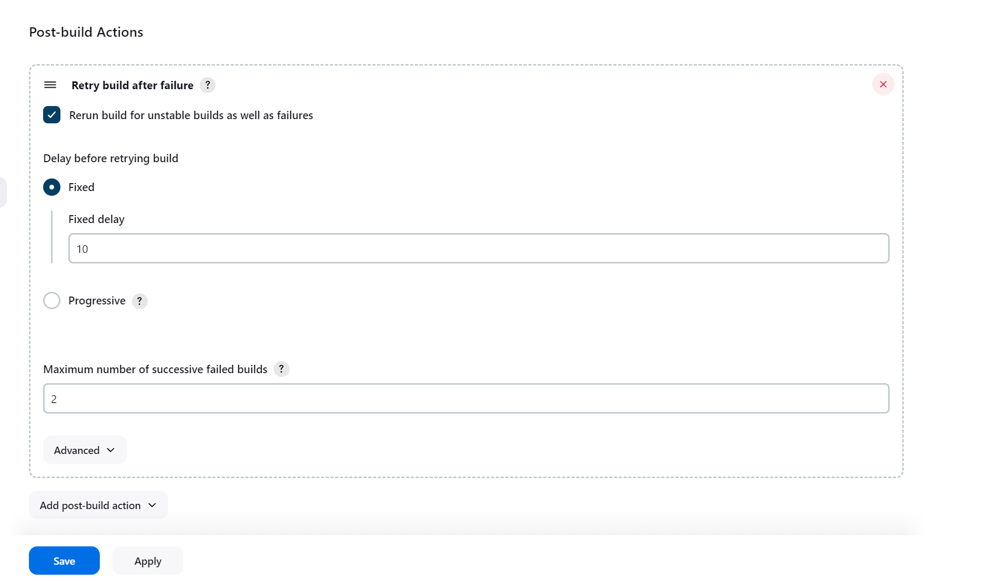

# Devuan的Jenkins部署

## 大致情况

 Jenkinsfile配置文件位于下方

 https://git.devuan.org/devuan/package-pipeline

 存在测试和实际部署的分支

 https://git.devuan.org/devuan/package-pipeline/src/branch/deployment

 https://git.devuan.org/devuan/package-pipeline/src/branch/testing


 ## 安装Jenkins

 https://www.jenkins.io/doc/book/installing/linux/

 目标平台 Debian amd64 x64 12

 

 添加证书/软件源

```
 sudo wget -O /usr/share/keyrings/jenkins-keyring.asc \
  https://pkg.jenkins.io/debian-stable/jenkins.io-2023.key

echo "deb [signed-by=/usr/share/keyrings/jenkins-keyring.asc]" \
  https://pkg.jenkins.io/debian-stable binary/ | sudo tee \
  /etc/apt/sources.list.d/jenkins.list > /dev/null

sudo apt-get update

sudo apt-get install jenkins
```

安装Java组件

```
sudo apt update

sudo apt install fontconfig openjdk-17-jre
```

测试Java安装
```
java -version
```
启动/启用Jenkins服务
```
sudo systemctl enable jenkins

sudo systemctl start jenkins

sudo systemctl status jenkins
```

访问目标平台的8080端口，下面是一个Demo地址

http://215.10.1.134:8080/


初始化登录时需要使用一个生成的密码，在下列位置查询
```
cat /var/lib/jenkins/secrets/initialAdminPassword

```

如果包来源是Github 且使用国内没有打洞特殊线路支持的 需要在目标主机上给git挂个代理

## 如何使构建错误后重新构建

在 Jenkins 控制台中，Manage Jenkins > Plugins

搜索 Naginator 插件并安装。

然后前往所在项目的配置页面 例如：mesa/configure 划到最下面

Post-build Actions 选择 Retry build after failure

大概是下面这样的表单，按需填写即可



效果如下，就会在失败后重新开始一轮构建，直到多次构建任然失败需要人工干预


## 如何使用Jenkins构建Debian软件包deb

分为两种方法，但是第一种暂不可用

### Debian Package Builder

这个是一个插件，非常方便，但是目前存在安全漏洞还未修复，处于下架状态

https://www.jenkins.io/security/plugins/#suspensions

https://plugins.jenkins.io/debian-package-builder/

https://www.jenkins.io/security/advisory/2022-01-12/#SECURITY-2546

### Jenkins Pipeline

这个是手动写一个脚本来实现操作

示例：


```
pipeline {
    agent any
    stages {
        stage('Build Debian Package') {
            steps {
                sh 'dpkg-buildpackage -us -uc'
                // 使用 archiving step 来保存输出的 .deb 包
                archiveArtifacts artifacts: '*.deb', fingerprint: true
            }
        }
    }
}
```

dpkg-buildpackage 命令被用来构建 Debian 包，archiveArtifacts 步骤则用来保存构建生成的 .deb 文件。
