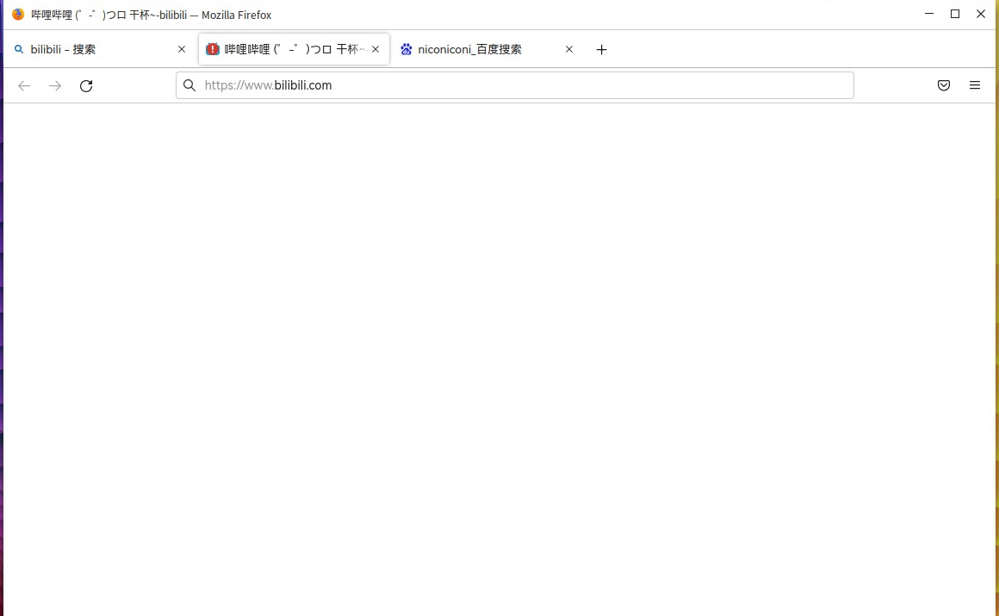
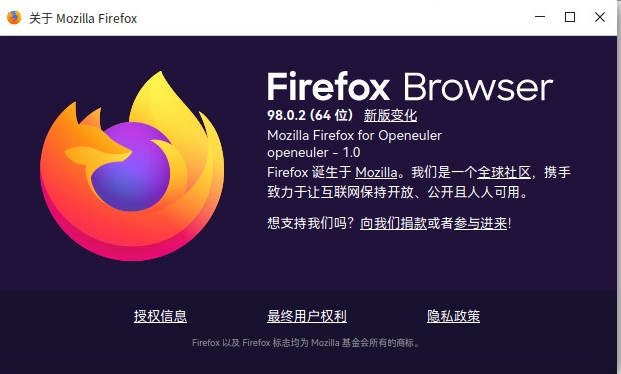

## Eulaceura 


### 前言

Eulaceura旨在为oerv提供一个较为稳定的发行版 今天就让我们一起来看看吧（跑


### 启动 Eulaceura 
默认所提供的启动脚本是无法启动GUI的 但是可以直接拿oe的启动脚本改 下面是个抄作业的环节（

```
qemu-system-riscv64 \
  -smp 12 -m 6G \
  -machine virt -bios fw_boot.bin \
  -display sdl \
  -audiodev pa,id=snd0 \
  -drive   file=Eulaceura-22H1-Desktop_vm.qcow2,id=hd0,format=qcow2 \
  -device virtio-vga \
  -device virtio-blk-device,drive=hd0 \
  -device virtio-net-device,netdev=usernet \
  -netdev  user,id=usernet,hostfwd=tcp::2222-:22 \
  -device qemu-xhci -usb -device usb-kbd -device usb-tablet -device usb-audio,audiodev=snd0 \


```


经过紧张刺激的开机之后我们成功进入了GUI界面  但是这个root登录的密码有亿点复杂 建议换一个好输一点的（


```
eula / ceura
root / Eulaceura12#$
```


可以看到界面采用了中文作为默认语言，体现了对英语不熟练的同学友好之处，同时体现了开发团队的文化自信。


### 系统环境及软件


#### 内核


进入系统后我们可以看到采用了5.10的内核


由于目前第一个版本并未配置软件源 感兴趣的同学可以按照如下方法配置


```
zypper ar https://repos.tarsier-infra.com/eulaceura/repos/Eulaceura.repo
```

#### Firefox

预装的软件方面可以看到主要有Firefox 可以满足基本的工作





本来是想看看汪老师的课程 不过发现未知原因打不开b站 只好作罢 


普通网页浏览正常


#### Kiran





系统的桌面采用的是Kiran


kiran桌面是湖南麒麟信安团队以用户和市场需求为导向，研发的一个安全、稳定、高效、易用的桌面环境。

这个我们在老朋友openEuler上也是有的


#### 其他软件


在预装的软件中还有Qt4 mpv  atril docker等工具  有着很强的生产力

其中除了mpv直接打不开之外（跑  其他均可正常运行


*Atril* 正常工作


#### 包管理工具


另外Eulaceura采用了ZYpp作为包管理工具

ZYpp包管理工具是一个一般用在openSUSE上的工具，出现在这里还是很意外的，目前oerv主要使用的是openeuler其使用的是yum管理工具

但是均是基于RPM 包管理的 所以相对来说还是比较方便同学们学习使用的

