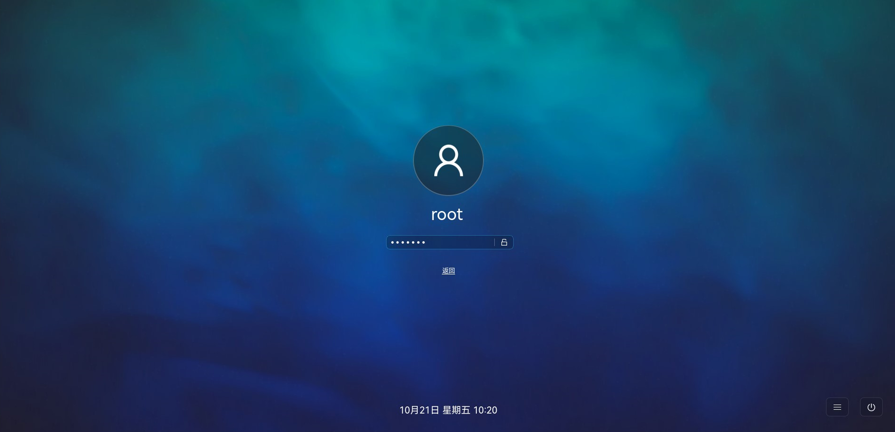
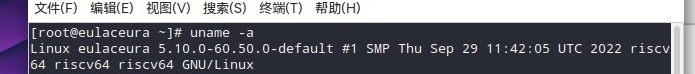

## Eulaceura 


Eulaceura旨在为oerv提供一个较为稳定的发行版 今天就让我们一起来看看吧（跑


默认所提供的启动脚本是无法启动GUI的 但是可以直接拿oe的启动脚本改 下面是个抄作业的环节（

```
qemu-system-riscv64 \
  -smp 12 -m 6G \
  -machine virt -bios fw_boot.bin \
  -display sdl \
  -audiodev pa,id=snd0 \
  -drive   file=Eulaceura-22H1-Desktop_vm.qcow2,id=hd0,format=qcow2 \
  -device virtio-vga \
  -device virtio-blk-device,drive=hd0 \
  -device virtio-net-device,netdev=usernet \
  -netdev  user,id=usernet,hostfwd=tcp::2222-:22 \
  -device qemu-xhci -usb -device usb-kbd -device usb-tablet -device usb-audio,audiodev=snd0 \


```


经过紧张刺激的开机之后我们成功进入了GUI界面  但是这个root登录的密码有亿点复杂 建议换一个好输一点的（


```
eula / ceura
root / Eulaceura12#$
```





可以看到界面采用了中文作为默认语言，体现了对英语不熟练的同学友好之处，同时体现了开发团队的文化自信。




进入系统后我们可以看到采用了5.10的内核


由于目前第一个版本并未配置软件源 感兴趣的同学可以按照如下方法配置


```
zypper ar https://repos.tarsier-infra.com/eulaceura/repos/Eulaceura.repo
```


预装的软件方面可以看到主要有Firefox 可以满足基本的工作


本来是想看看汪老师的课程 不过Firefox貌似对于多媒体内容较多的暂时存在一点问题 


普通网页浏览正常


在预装的软件中还有Qt4 mpv atril docker等工具  有着很强的生产力


另外Eulaceura采用了ZYpp作为包管理工具


