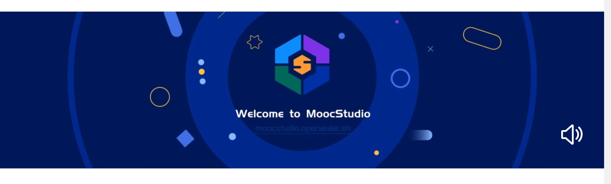
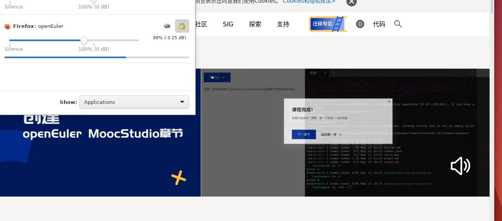
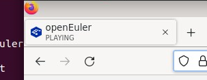
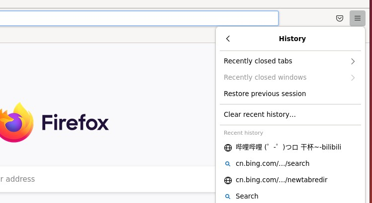
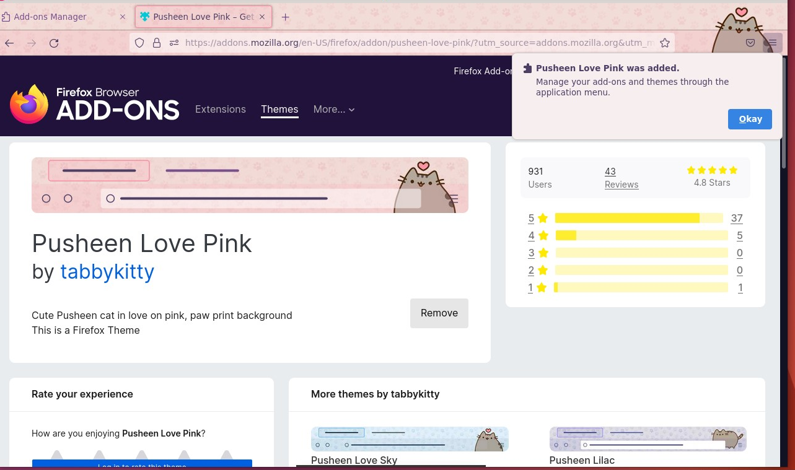
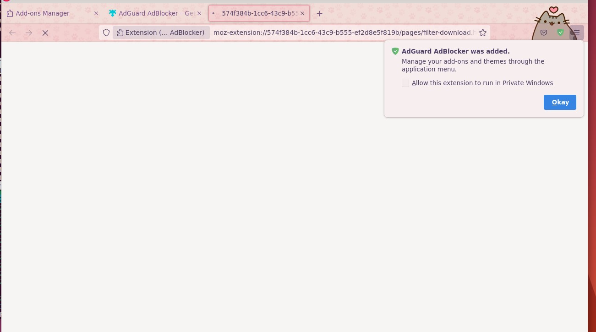
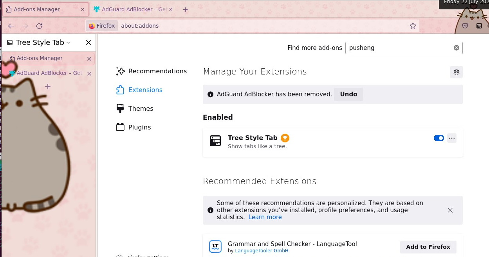

# Firefox 使用测试

## 视频测试

项目1：

播放 https://www.openeuler.org/zh/ 页面的视频 并开启声音

预期：正常播放并有声音

结果1：

可正常播放 同时声音正常

浏览器检测页面播放正常

## 无痕模式

项目1：打开无痕模式并访问  https://www.openeuler.org/zh/  访问结束后关闭 并确认记录没有记录在历史记录中

预期：无痕模式成功开启并正常关闭，历史记录没有被保存

结果：

无痕模式成功开启并正常关闭，历史记录没有被保存

## 主题安装

项目1：打开 https://addons.mozilla.org/en-US/firefox/ 并寻找 Pusheen Love Pink 主题 并安装

预期：成功安装并显示

结果：

成功安装并显示

## 插件安装

项目1：打开https://addons.mozilla.org/en-US/firefox/addon/adguard-adblocker/ 并安装

预期：成功安装并打开www.speedtest.net广告均被移除

结果：

安装成功但无法初始化插件且导致无法访问网站

项目1：打开https://addons.mozilla.org/en-US/firefox/addon/tree-style-tab/并安装

预期：成功安装并使用

结果：

成功安装并使用

